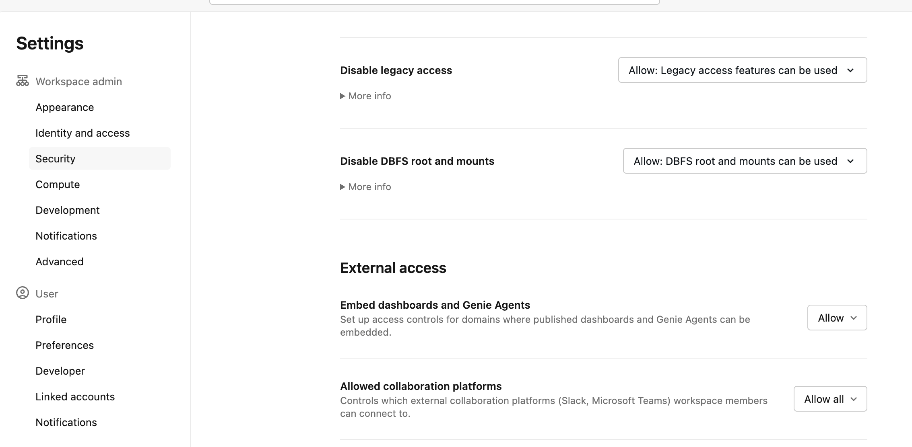

# Multi-agent app

A Databricks App where users ask questions in a chat UI. An orchestrator (`databricks-gpt-5-6-luna`) can answer from **AI Search** (semantic retrieval over the parsed manuals) and one or more **Genie** spaces (natural-language Q&A / reasoning over the PDFs), and it stores conversation memory in **Lakebase**.

The chat UI also has an **Agents** tab that embeds a Genie space in an iframe. That embed only works if the target workspace allows it (see [Required workspace setting](#required-workspace-setting-embed-genie) below).

## Bundle

This folder is the `multi_agent_app` Databricks Asset Bundle. It owns the Databricks App, Lakebase (memory + chat history), and the MLflow experiment.

> The AI Search index is **not** created by the bundle. Set its full name in `databricks.yml` (`ai_search_index`).

> Genie spaces are **not** created by the bundle. They are created outside the project; the client passes their ids (and a short description) to the app via the `genie_agents` variable, and the app exposes each one as an orchestrator tool.

## What the client must change before deploy

Defaults point at a demo workspace (`stable_classic_6kvrb7_catalog.cesar_cordoba`). **They will not work on a customer workspace.** Edit `databricks.yml`:

| Variable / field | Set to |
|------------------|--------|
| `workspace.host` | Customer workspace URL |
| `catalog` | Customer Unity Catalog |
| `schema` | Schema the deployer can write to |
| `ai_search_index` | `{catalog}.{schema}.knowledge_base_vs_index` |
| `genie_agents` | JSON list of `{id, name, description}` for the customer's Genie spaces |
| `genie_high_effort` | `"true"` = Genie agent mode (reasons over PDFs); `"false"` = chat mode (Genie MCP) |
| `lakebase_project_id` | Leave the default unless the name collides |

The catalog and schema must already exist. The AI Search index must already exist at `ai_search_index`.

## Deploy the bundle and run the app

From this folder (`public_demo/mult_agent_supervisor_app`). Replace `custom_profile` with a profile from `~/.databrickscfg`.

```bash
databricks bundle validate --target dev --profile custom_profile
databricks bundle deploy  --target dev --profile custom_profile
databricks bundle run agent_openai_agents_sdk_multiagent --target dev --profile custom_profile
```

`bundle deploy` uploads files and creates/updates resources. `bundle run` is required to start (or restart) the app with that code.

The app is named `agent-openai-multiagent` (production target) or the development-prefixed name on `dev`. Open it from **Workspace → Compute → Apps**.

## Local development

From `agent_app/`, `uv run quickstart` configures Databricks auth, tracing, and starts the local server + chat UI:

```bash
cd agent_app
uv run quickstart --profile "custom_profile"
```

After that, start again with `uv run start-app` (http://localhost:8000). More detail is in `agent_app/README.md`.

## What the bundle creates

| Resource | Name / location | Role |
|----------|-----------------|------|
| Databricks App | `agent-openai-multiagent` | Chat UI + orchestrator (AI Search tool + Genie tools) |
| Lakebase project | `technical-manuals-agent-memory` | Postgres 17 instance (memory + UI chat history) |
| Lakebase database | `agent_memory` | Database the app connects to |
| MLflow experiment | `/Users/{deployer}/samsung-manuals-agent-{target}` | Agent traces |

The app is granted `SELECT` on the AI Search index and `CAN_CONNECT_AND_CREATE` on the Lakebase database. Genie tools run **on behalf of the requesting user** (the app declares `user_api_scopes: [genie]`), so no per-space service-principal grant is needed — each user must have `CAN_RUN` on the spaces passed in `genie_agents`.

## How it fits together

The **app** (`agent_app/`) routes each question to the `search_manuals` tool (AI Search) and/or the configured Genie tools, and persists sessions in Lakebase.

- **High Effort ON** (default) → Genie runs in **agent mode** (agentic REST, reasons over the PDFs).
- **High Effort OFF** → Genie runs in **chat mode** (Genie MCP), which is faster. The toggle is in the chat UI and can be overridden per request via `custom_inputs.high_effort`.

More detail on local run, memory grants, and customizing the agent lives in `agent_app/README.md`.

## Required workspace setting: embed Genie

A workspace admin on the **customer workspace** must allow embeds. If this is off, the app loads but the Agents-tab Genie pane stays blank.

1. Open the workspace as a **Workspace admin**.
2. Go to **Settings → Security**.
3. Under **External access**, set **Embed dashboards and Genie Agents** to **Allow**.


